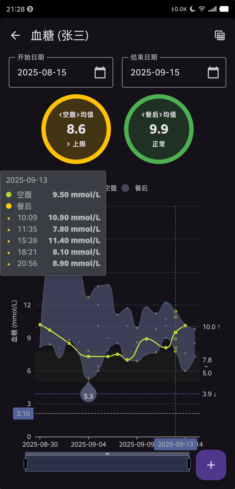

# Health Tracker - 健康数据跟踪

简单实用的血压、血糖、体重等健康数据监测 App。

 

## 开发

- 克隆代码
  ```bash
  git clone git@github.com:crazydan-studio/health-tracker.git

  git submodule init
  git submodule update
  ```

- 目前定制的 ECharts 库仅包含图表 `Line`、`Scatter`，
  若需要重新[定制 ECharts](https://echarts.apache.org/en/builder.html)，
  则需将定制的 `echarts.min.js` 覆盖 `/app/src/main/assets/echarts/echarts.min.js`
  > 更多说明详见 [echarts-android](https://github.com/crazydan-studio/echarts-android)

## 调试

- 若 Release 版本安装失败，可尝试通过 `adb` 安装以得到失败原因：
  ```bash
  adb install -t  app/build/outputs/apk/release/app-release.apk
  ```
  > Note: 目标环境需启用 USB 调试，并通过 USB 连接到开发主机
